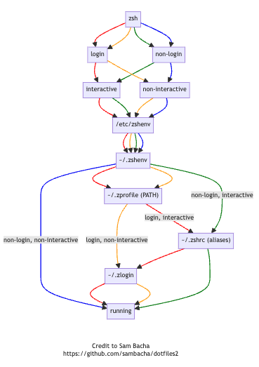

# Z Shell Start-up Scripts

<html>

<table class="tg"><thead>
  <tr>
    <th class="tg-baqh" colspan="4">zsh</th>
  </tr></thead>
<tbody>
  <tr>
    <td class="tg-c3ow" colspan="2">login</td>
    <td class="tg-c3ow" colspan="2">non-login</td>
  </tr>
  <tr>
    <td class="tg-c3ow">interactive</td>
    <td class="tg-c3ow">non-interactive</td>
    <td class="tg-c3ow">interactive</td>
    <td class="tg-c3ow">non-interactive</td>
  </tr>
  <tr>
    <td class="tg-c3ow" colspan="4">~/.zshenv</td>
  </tr>
  <tr>
    <td class="tg-c3ow" colspan="2">.zprofile</td>
    <td class="tg-c3ow"></td>
    <td class="tg-c3ow"></td>
  </tr>
  <tr>
    <td class="tg-baqh">.zshrc</td>
    <td class="tg-baqh"></td>
    <td class="tg-baqh">.zshrc</td>
    <td class="tg-baqh"></td>
  </tr>
  <tr>
    <td class="tg-baqh" colspan="2">.zlogin</td>
    <td class="tg-baqh"></td>
    <td class="tg-baqh"></td>
  </tr>
</tbody>
</table>
</html>
